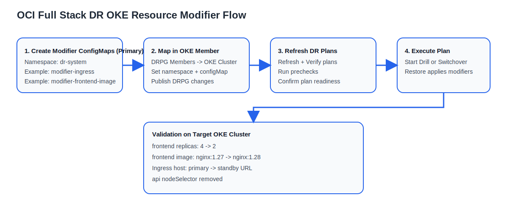
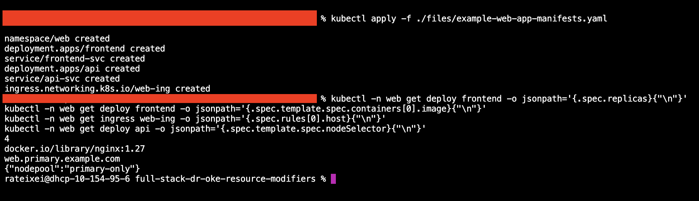
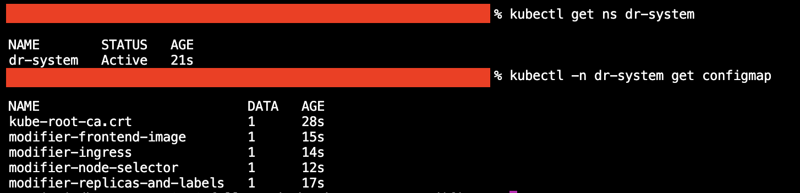
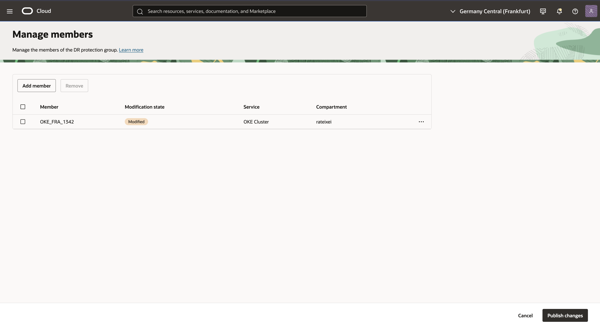
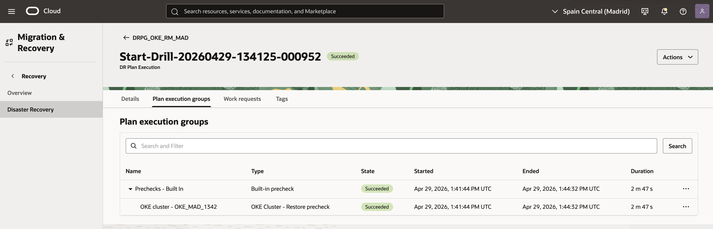
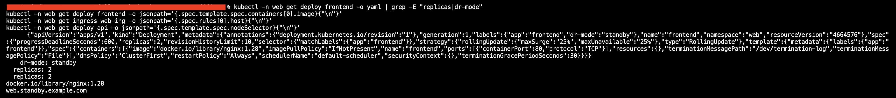

# Use Kubernetes Resource Modifiers During OCI Full Stack DR Plan Execution

## Introduction

Oracle Cloud Infrastructure Full Stack Disaster Recovery (OCI Full Stack DR) supports OKE clusters as DR protection group (DRPG) members.  
With the Kubernetes resource modifier capability, you can map one or more ConfigMaps to the OKE member so resource changes are applied during restore and plan execution.

This helps you adjust Kubernetes manifests for DR needs without manually editing workloads during a live event.

Typical use cases include:

* Using different replica counts in the standby region.
* Changing container image tags or ingress behavior per region.
* Adding DR labels/annotations for operational visibility.
* Removing or adjusting settings that are not valid in the target environment.


<br>**Figure 1:** End-to-end flow for OKE resource modifiers in OCI Full Stack DR.

> **Note:** This tutorial was validated against Oracle documentation available on **April 18, 2026**.

### Objectives

By the end of this tutorial, you will be able to:

* Create Kubernetes resource modifier ConfigMaps.
* Add an OKE cluster member to OCI Full Stack DR with resource modifier mappings.
* Refresh and verify DR plans after OKE member updates.
* Validate modified resources during drill or switchover plan execution.

### Prerequisites

* Access to OCI tenancy with permissions to manage:
  * OCI Full Stack DR
  * OKE clusters
  * IAM policies required for Full Stack DR and OKE
* A pair of associated DR protection groups (primary and standby).
* An OKE cluster pair or an OKE topology already prepared for your DR design.
* `kubectl` access to both OKE clusters (primary and standby).

For IAM guidance, see:

* [Policies for OCI Full Stack DR](https://docs.oracle.com/en-us/iaas/disaster-recovery/doc/disaster-recovery-policies.html)
* [Policies for OKE managed by OCI Full Stack DR](https://docs.oracle.com/en-us/iaas/disaster-recovery/doc/dr-managed-services-policies.html)

## Task 1: Deploy Sample Kubernetes Resources Aligned with Modifiers

Deploy a sample application stack first so all modifier examples can be tested against real resources.

1. Apply the sample manifests from the tutorial `files` folder.

   ```bash
   kubectl apply -f ./files/example-web-app-manifests.yaml
   ```

2. Confirm baseline values before any DR plan execution.

   ```bash
   kubectl -n web get deploy frontend -o jsonpath='{.spec.replicas}{"\n"}'
   kubectl -n web get deploy frontend -o jsonpath='{.spec.template.spec.containers[0].image}{"\n"}'
   kubectl -n web get ingress web-ing -o jsonpath='{.spec.rules[0].host}{"\n"}'
   kubectl -n web get deploy api -o jsonpath='{.spec.template.spec.nodeSelector}{"\n"}'
   ```

   Expected baseline output:

   * `frontend` replicas: `4`
   * `frontend` image: `docker.io/library/nginx:1.27`
   * `web-ing` host: `web.primary.example.com`
   * `api` nodeSelector includes `nodepool: primary-only`


<br>**Figure:** Baseline resource values in the primary cluster before DR plan execution.

## Task 2: Prepare the Kubernetes Resource Modifier ConfigMaps

Create one or more ConfigMaps that contain resource modifier rules on the **primary** cluster.  
These ConfigMaps are later mapped in the OKE member configuration.

1. Create the `dr-system` namespace if it does not exist.
2. Create ConfigMap files for your use cases, then apply them.

   ```bash
   kubectl create namespace dr-system
   kubectl apply -f ./files/modifier-replicas-and-labels.yaml
   kubectl apply -f ./files/modifier-frontend-image.yaml
   kubectl apply -f ./files/modifier-ingress.yaml
   kubectl apply -f ./files/modifier-node-selector.yaml
   ```

3. Verify the ConfigMaps are present.

   ```bash
   kubectl -n dr-system get configmap
   kubectl -n dr-system get configmap modifier-replicas-and-labels -o jsonpath='{.data.config\.yaml}' | head -c 120
   ```

> **Tip:** Start with one or two small modifier files and expand once validated in a drill.


<br>**Figure:** `dr-system` namespace and resource modifier ConfigMaps created in the primary cluster.

## Task 3: Add OKE Cluster Member with Resource Modifier Mappings

1. In OCI Console, open **Migration & Disaster Recovery**, then **DR protection groups**.
2. Open the **primary** DR protection group.
3. Go to **Members** and click **Manage members**.
4. Click **Add member** and choose **OKE Cluster** as member type.
5. Select the primary and peer cluster details.
6. In **Resource modifier mappings**, add the namespace/ConfigMap pairs (for example, `dr-system` + `modifier-replicas-and-labels`).
7. Add additional mappings as needed for other ConfigMaps.
8. Complete member creation and publish DRPG changes.


<br>**Figure 2:** Example OKE member configuration with multiple resource modifier mappings.


<br>**Figure:** Publish DR protection group changes after adding OKE member modifier mappings.

> **Important:** Keep OKE member management in the **primary** protection group, and ensure the referenced modifier ConfigMaps exist in the **primary** cluster namespace.

## Task 4: Refresh and Verify DR Plans

After member updates, DR plans usually enter a refresh-required state.

1. In the standby DR protection group, open **DR Plans**.
2. Refresh affected plans (for example, switchover, failover, start drill).
3. Verify plans.
4. Run prechecks.
5. Confirm prechecks complete successfully before executing any plan.


<br>**Figure:** DR plans refreshed, verified, and prechecks completed in the standby DR protection group.

## Task 5: Execute a Drill or Switchover and Validate Applied Modifiers

1. Run **Start Drill** (recommended first) or **Switchover** from the standby DRPG.
2. After plan completion, use `kubectl` against the target cluster to validate resources.
3. Compare the restored resource state with expected modifier outcomes.

   Validation examples:

   ```bash
   kubectl -n web get deploy frontend -o yaml | grep -E "replicas|dr-mode"
   kubectl -n web get deploy frontend -o jsonpath='{.spec.template.spec.containers[0].image}{"\n"}'
   kubectl -n web get ingress web-ing -o jsonpath='{.spec.rules[0].host}{"\n"}'
   kubectl -n web get deploy api -o jsonpath='{.spec.template.spec.nodeSelector}{"\n"}'
   ```

   If results are not as expected:

   * Confirm the mapped ConfigMap name and namespace.
   * Confirm the mapped ConfigMaps exist in the **primary** cluster and namespace.
   * Confirm rule target namespace/resource names are correct.
   * Re-run with a drill plan after corrections.

Expected before/after states for resources modified during DR plan execution:

| Resource | Before plan | After plan |
| --- | --- | --- |
| Deployment `web/frontend` (`/spec/replicas`) | `replicas: 4` | `replicas: 2` and label `dr-mode=standby` |
| Deployment `web/frontend` (`/spec/template/spec/containers/0/image`) | `docker.io/library/nginx:1.27` | `docker.io/library/nginx:1.28` |
| Ingress `web/web-ing` (`/spec/rules/0/host`) | `web.primary.example.com` | `web.standby.example.com` |
| Deployment `web/api` (`/spec/template/spec/nodeSelector`) | `nodepool: primary-only` | `nodeSelector` removed |

Modifier mapping reference:

* `modifier-replicas-and-labels` applies to `web/frontend` replicas and `dr-mode` label.
* `modifier-frontend-image` applies to `web/frontend` container image.
* `modifier-ingress` applies to `web/web-ing` host.
* `modifier-node-selector` applies to `web/api` node selector.


<br>**Figure:** Post-execution validation output confirming resource modifier changes on the target cluster.

## Task 6: Example Resource Modifier Files

The following examples are ready-to-adapt templates for common DR adjustments.

### Resource Modifier Patch Operations

Resource modifier `patches` use JSON Patch operation names.  
Use the operation that matches the intent of the DR change you need to apply.

| Operation | When to use it | Required fields | DR examples |
| --- | --- | --- | --- |
| `add` | Add a missing field, object, or array item. | `path`, `value` | Add a DR label or annotation, add a toleration, add an environment variable. |
| `replace` | Change an existing value at a known path. | `path`, `value` | Change replica count, container image tag, ingress host, or storage class. |
| `remove` | Delete a field that is invalid or not wanted in the target environment. | `path` | Remove a primary-only `nodeSelector`, affinity rule, label, or annotation. |
| `copy` | Duplicate an existing value from one path to another path. | `from`, `path` | Copy a container, environment variable, or template value before applying a later adjustment. |
| `move` | Move a value from one path to another and remove it from the original path. | `from`, `path` | Use only for advanced manifest reshaping when a value must be relocated. |
| `test` | Check that a value matches before applying later patches. | `path`, `value` | Guard a risky change so a plan does not silently modify an unexpected resource state. |

Example using `test` before `replace`:

```yaml
patches:
- operation: test
  path: "/spec/replicas"
  value: 4
- operation: replace
  path: "/spec/replicas"
  value: 2
```

> **Tip:** Prefer `replace`, `add`, and `remove` for most DR-specific changes. Use `test` when you want the modifier to apply only if the source resource is in the expected state. Use `copy` and `move` sparingly, because they make the restored manifest harder to reason about.

> **Note:** Patches in a rule are applied in the order listed. If multiple patches target the same path, later patches operate on the result of earlier patches.

### Example 1: Scale Replicas and Add DR Label

```yaml
apiVersion: v1
kind: ConfigMap
metadata:
  name: modifier-replicas-and-labels
  namespace: dr-system
data:
  config.yaml: |
    version: v1
    resourceModifierRules:
    - conditions:
        groupResource: deployment
        resourceNameRegex: "^frontend$"
        namespaces:
        - web
      patches:
      - operation: replace
        path: "/spec/replicas"
        value: 2
      - operation: add
        path: "/metadata/labels/dr-mode"
        value: "standby"
```

### Example 2: Update Deployment Container Image

```yaml
apiVersion: v1
kind: ConfigMap
metadata:
  name: modifier-frontend-image
  namespace: dr-system
data:
  config.yaml: |
    version: v1
    resourceModifierRules:
    - conditions:
        groupResource: deployment
        resourceNameRegex: "^frontend$"
        namespaces:
        - web
      patches:
      - operation: replace
        path: "/spec/template/spec/containers/0/image"
        value: "docker.io/library/nginx:1.28"
```

### Example 3: Change Ingress Host in DR Region

```yaml
apiVersion: v1
kind: ConfigMap
metadata:
  name: modifier-ingress
  namespace: dr-system
data:
  config.yaml: |
    version: v1
    resourceModifierRules:
    - conditions:
        groupResource: ingress
        resourceNameRegex: "^web-ing$"
        namespaces:
        - web
      patches:
      - operation: replace
        path: "/spec/rules/0/host"
        value: "web.standby.example.com"
```

### Example 4: Remove Node Selector Constraint

Use this when standby workers do not have the same labels as primary workers.

```yaml
apiVersion: v1
kind: ConfigMap
metadata:
  name: modifier-node-selector
  namespace: dr-system
data:
  config.yaml: |
    version: v1
    resourceModifierRules:
    - conditions:
        groupResource: deployment
        resourceNameRegex: "^api$"
        namespaces:
        - web
      patches:
      - operation: remove
        path: "/spec/template/spec/nodeSelector"
```

> **Note:** Test each patch rule in drill mode first. Keep changes minimal and environment-specific.

## Summary

You deployed a stateless Kubernetes sample stack, configured resource modifier mappings for an OKE member in OCI Full Stack DR, and validated how those modifiers are applied during plan execution, while managing ConfigMaps on the primary cluster.

With this approach, you can keep DR execution repeatable while adapting Kubernetes resources to regional differences safely.

## Related Links

* [Add OKE cluster members to a DR protection group](https://docs.oracle.com/en-us/iaas/disaster-recovery/doc/add-oke-cluster-protection-group.html)
* [Prechecks performed by OCI Full Stack DR](https://docs.oracle.com/en-us/iaas/disaster-recovery/doc/prechecks-disaster-recovery.html)
* [Built-In plan groups and supported member types](https://docs.oracle.com/en-us/iaas/disaster-recovery/doc/built-in-plan-groups.html)
* [Policies for Other Services Managed by Full Stack DR](https://docs.oracle.com/en-us/iaas/disaster-recovery/doc/dr-managed-services-policies.html)
* [OCI Full Stack DR new features (Dec 2025, Part 2)](https://blogs.oracle.com/maa/oci-full-stack-dr-new-features-december-2025-part2)
* [JSON Patch RFC 6902](https://www.rfc-editor.org/rfc/rfc6902)
* [Velero Restore Resource Modifiers](https://velero.io/docs/v1.17/restore-resource-modifiers/)

## Acknowledgments

- **Author** - Raphael Teixeira (Principal Product Manager for OCI Full Stack DR)
